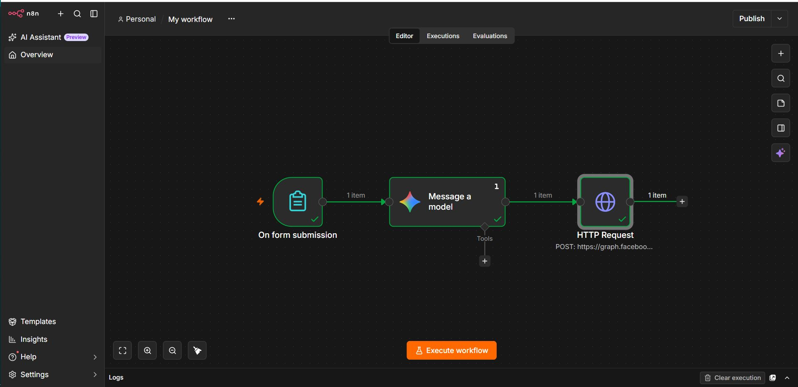

# 🚀 Automated AI Lead Enricher & WhatsApp Alert Agent

A production-ready, self-hosted automation pipeline built using **n8n** running on Docker. This system instantly captures inbound customer leads from a native web form, passes company data to **Google Gemini AI** for real-time market research, and dispatches a structured notification instantly to **WhatsApp via the Meta Business Cloud API**.

---

## 🏗️ System Architecture & Workflow



1. **Lead Generation:** A native n8n form collects customer submission metadata (`Name`, `Email`, `Company`).
2. **AI Enrichment:** The pipeline passes the `Company` value to Google Gemini via API. The LLM conducts an immediate business analysis to extract industry vertical and intent data.
3. **Instant Notification:** A webhook automatically payload-maps the structured message parameters into Meta’s WhatsApp Business API, alerting internal stakeholders in under 3 seconds.

---

## 🛠️ Tech Stack & Infrastructure

- **Workflow Engine:** n8n (Self-Hosted via Docker Desktop)
- **Artificial Intelligence:** Google Gemini AI API (`gemini-1.5-flash`)
- **Communication Layer:** Meta WhatsApp Business Cloud API
- **Containerization:** Docker

---

## ⚙️ Local Deployment & Installation

### 1. Clone & Spin up n8n
Ensure you have **Docker Desktop** installed and running on your machine. Start the detached n8n container via terminal:

```bash
docker run -d --name n8n -p 5678:5678 -v n8n_data:/home/node/.n8n n8nio/n8n
```
Access your canvas UI locally at `http://localhost:5678`.

### 2. Import the Workflow Blueprint
1. Download the `workflow_blueprint.json` file included in this repository.
2. Open your n8n workspace dashboard.
3. Click the **Three Dots** top-right -> Select **Import from File** and upload the JSON layout.

### 3. Configure API Credentials
- **Google Gemini Node:** Generate a free sandbox API token via [Google AI Studio](https://google.com) and paste it under the credentials section.
- **WhatsApp Node:** Register your app via the [Meta for Developers Dashboard](https://facebook.com). Copy your `Phone Number ID`, `Temporary Access Token`, and enforce the default template language parameter set to `en_US`.

---

## 🎯 Key Metrics & Outcomes
- **Zero Operating Cost:** Powered entirely via Docker self-hosting and generous cloud-free tiers (Google AI Studio & Meta Sandbox).
- **Asynchronous Execution:** Replaces manual B2B research steps, saving up to 5 minutes of data aggregation per lead.
- **High Extensibility:** Modular architecture allows swap-ins for alternative CRM paths (e.g., Salesforce, HubSpot) or local LLMs (e.g., Ollama running Llama 3).


### 🐳 Advanced Deployment: Multi-Container Setup (Recommended)

Instead of running an isolated container with an unstable local memory file, you can deploy a robust production-grade stack including a **PostgreSQL Database backend** for transaction history logging. 

1. Ensure `docker-compose.yml` is in your working directory.
2. Spin up the entire integrated ecosystem:
   ```bash
   docker compose up -d
   ```
3. Docker will automatically configure the networks, wait for PostgreSQL to pass its health checks, and launch n8n safely at `http://localhost:5678`.
